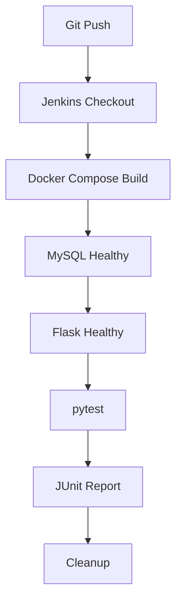

# Flask Student API 自动化测试项目

一个面向测试开发实践的接口自动化项目。项目以 Flask Student API 为测试对象，使用 pytest 与 requests 组织接口测试，通过 PyMySQL 校验数据库结果，并使用 Docker Compose 一次性启动 MySQL、Flask 和测试容器。Jenkins Pipeline 负责拉取代码、构建环境、执行测试、发布 JUnit 报告和清理资源。

当前状态：Jenkins Build #38 `SUCCESS`，共 `32 passed`。

## 技术栈

- Python 3.12
- Flask
- pytest
- requests
- PyMySQL / MySQL
- Allure pytest 插件
- Docker / Docker Compose
- Jenkins Pipeline / JUnit Report
- GitHub / GitHub Actions

## 项目结构

```text
flask-student-api-test/
├── .github/workflows/test.yml  # GitHub Actions 测试任务
├── api/
│   └── student_api.py          # Student API 请求封装
├── app/
│   └── user.py                 # 用户模块单元测试示例
├── docs/
│   └── PROJECT_CONTEXT.md      # 项目背景与缺陷排查记录
├── server/
│   └── app.py                  # Flask API 服务
├── scripts/
│   └── check_db.py             # 手动数据库连通性检查
├── sql/
│   └── init.sql                # MySQL 初始化脚本
├── tests/
│   ├── examples/               # pytest 基础用法示例
│   ├── test_api.py             # 登录与用户信息关联测试
│   ├── test_login.py           # 登录参数化测试
│   ├── test_students.py        # 学生 CRUD 与数据库校验
│   ├── test_user.py            # 用户模块单元测试
│   └── test_userinfo.py        # 用户信息接口测试
├── config.py                   # API 地址配置
├── conftest.py                 # pytest fixtures 与测试数据清理
├── db_utils.py                 # 测试侧数据库连接
├── docker-compose.yml          # MySQL、Flask、pytest 服务编排
├── Dockerfile                  # Flask 与 pytest Python 镜像
├── Dockerfile.mysql            # MySQL 测试镜像
├── Jenkinsfile                 # Jenkins CI Pipeline
├── pytest.ini                  # pytest 收集规则
└── requirements.txt            # Python 依赖
```

## 测试覆盖

- 用户登录：成功、密码错误、用户不存在
- 用户信息：Token 鉴权及响应字段校验
- 学生管理：新增、列表查询、单条查询、修改、删除
- 参数化测试：年龄边界值 `0 / 1 / 50 / 100 / 101`
- 数据库校验：接口写入结果与 MySQL 数据一致性
- 业务流程：学生新增、查询、修改、删除完整链路
- 测试数据治理：fixture 和 `finally` 保证数据清理

## 快速开始

### 1. 本地运行 pytest

本地运行需要 Python 3.12、可访问的 MySQL 以及已启动的 Flask 服务。

```bash
pip install -r requirements.txt
python server/app.py
pytest
```

测试配置支持通过环境变量覆盖：

| 变量 | 默认值 | 说明 |
| --- | --- | --- |
| `BASE_URL` | `http://127.0.0.1:5000` | Flask API 地址 |
| `DB_HOST` | `127.0.0.1` | MySQL 地址 |
| `DB_PORT` | `3307` | 本地测试数据库端口 |
| `DB_USER` | `root` | 测试数据库用户 |
| `DB_PASSWORD` | `king` | 测试数据库密码 |
| `DB_NAME` | `test_db` | 测试数据库名 |

以上凭据仅用于本地或容器化演示环境，不应复用于生产环境。

### 2. Docker Compose 运行

```bash
docker compose up --build
```

执行与 Jenkins 相同的“一次构建并返回 pytest 退出码”流程：

```bash
docker compose up --build --abort-on-container-exit --exit-code-from test
docker compose down --volumes --remove-orphans
```

Compose 内部通过服务名通信：pytest 使用 `http://flask:5000` 请求 API，并通过 `mysql:3306` 连接数据库。MySQL healthy 后启动 Flask，Flask healthy 后再运行 pytest。

### 3. Allure 结果

```bash
pytest --alluredir=report
allure serve report
```

`allure-pytest` 已包含在 Python 依赖中；查看 HTML 报告还需要单独安装 Allure Commandline。

## Jenkins CI

向 GitHub 提交代码后，在 Jenkins 执行该项目的 Pipeline：



Pipeline 的关键行为：

1. 验证 Docker Engine 和 Docker Compose 可用。
2. 使用独立项目名 `student-api-${BUILD_NUMBER}` 隔离每次构建。
3. 根据健康检查顺序启动 MySQL、Flask 和 pytest。
4. 由 `--exit-code-from test` 将测试结果作为构建结果。
5. 将测试容器中的 JUnit XML 复制到 Jenkins workspace 并发布。
6. 无论构建结果如何都执行 Compose cleanup。

最近一次完整验证：Jenkins Build #38，`32 passed`，最终状态 `SUCCESS`。

## GitHub Actions

`.github/workflows/test.yml` 在推送或向 `master` 提交 Pull Request 时运行。它会启动 MySQL service、初始化数据库、启动 Flask 并执行同一套 pytest 用例，作为 Jenkins 之外的轻量验证通道。

## 设计说明

- `api/student_api.py` 集中封装学生接口，测试代码关注场景与断言。
- `conftest.py` 统一提供登录 Token、requests Session、API Client、数据库连接和测试数据。
- API 断言与数据库断言结合，避免只验证 HTTP 返回而遗漏数据落库问题。
- 测试环境完全容器化，降低本地和 Jenkins 环境差异。
- 项目保留少量 pytest 基础示例，用于展示 fixture、scope、yield 和参数化用法。

## 已验证结果

```text
MySQL healthy
Flask healthy (0.0.0.0:5000)
pytest: 32 passed
JUnit report recorded
Docker Compose cleanup completed
Jenkins: SUCCESS
```
